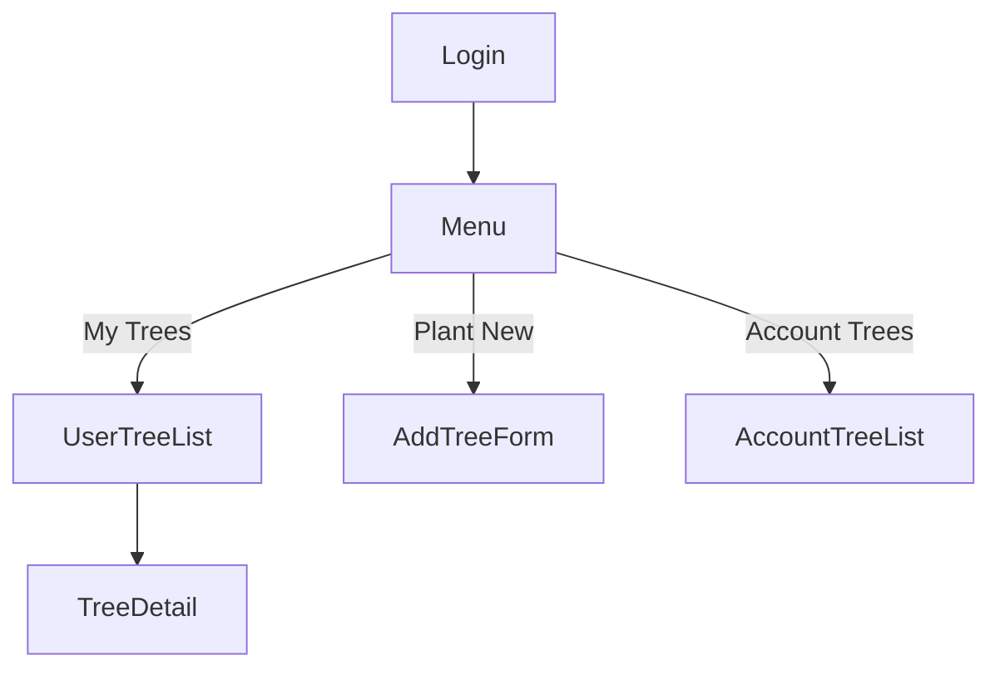

# 🌱 Trees Everywhere

Projeto desenvolvido como parte do processo seletivo da Youshop.  
O objetivo é registrar árvores plantadas por usuários em diferentes contas, com dados de localização, tipo da árvore e histórico por usuário.

A aplicação foi construída com Django, utilizando boas práticas, testes automatizados, views protegidas e uma interface leve.

---

## ⚙️ Como rodar o projeto

1. Clone o repositório:
```bash
git clone https://github.com/seu-usuario/trees-everywhere.git
cd trees-everywhere
```

2. Crie e ative o ambiente virtual:
```bash
python -m venv venv
source venv/bin/activate  # ou .\venv\Scripts\activate no Windows
```

3. Instale as dependências:
```bash
pip install -r requirements.txt
```

4. Execute as migrações:
```bash
python manage.py migrate
```

5. Crie um superusuário:
```bash
python manage.py createsuperuser
```

6. Rode o servidor:
```bash
python manage.py runserver
```

Acesse em: [http://localhost:8000](http://localhost:8000)

---

## 🧪 Como rodar os testes

```bash
python manage.py test
```

Todos os testes estão localizados em `trees/tests.py` e cobrem:
- Exibição de árvores do usuário
- Proteção contra acesso de outro usuário (403)
- Exibição de árvores das contas do usuário
- Métodos `plant_tree()` e `plant_trees()` do modelo `User`

---

## 🧠 Decisões técnicas

- Modelagem baseada no diagrama proposto
- Customização de admin para facilitar cadastro e visualização
- Views protegidas com autenticação e verificação de pertencimento
- HTML com `base.html` reutilizável e layout centralizado
- CSS customizado com cores da Youshop (verde, azul e branco)
- Algumas views foram implementadas com Class-Based Views (CBVs), aplicando princípios de Orientação a Objetos (OOP).

---

## 🔁 Fluxo resumido


